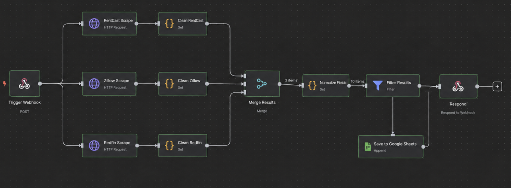

# REAI — Real Estate AI Agent Prototype

A real-estate AI agent developed for REAI, focused on combining property data, investor criteria, and automated reporting into a single workflow.

**Role:** Co-Founder  
**Project Status:** Concluded — October 2025  
**Development Period:** May 2025 – October 2025

> **Note:** This repository documents an in-progress prototype and technical exploration. The system was not released as a final production product.

## Project Overview

REAI was built as a prototype to reduce the manual work involved in reviewing real-estate investment opportunities.

The project explored property-data collection, investment calculations, workflow automation, and automated report delivery. Property information such as address, list price, bedrooms, bathrooms, square footage, and descriptions could be organized for further analysis and investor-specific filtering.

The broader workflow connected data collection with n8n, Google services, and messaging APIs to test how property information could move from a listing source to an investor-facing report.

## Key Features

- **Workflow Automation:** Built multi-step automation flows connecting property data, investment calculations, and report generation.
- **Investment Metrics:** Used **n8n** workflows to calculate price-drop percentage, negotiation margin, and estimated rental yield.
- **Data Organization:** Structured property information for processing in **Google Sheets** and downstream analysis.
- **Automated Reporting:** Configured report delivery through **Gmail and WhatsApp APIs**, with output formatted through Google Docs.
- **Browser Automation Prototype:** Experimented with **Playwright and AgentQL** for authenticated navigation and structured listing-data collection.

## Technologies

**Python, Playwright, AgentQL, n8n, Google APIs, WhatsApp API**

## Workflow

Property Data → Structured Processing → n8n Analysis → Investor Report → Gmail / WhatsApp

## Prototype Status

The workflow remained under active experimentation throughout development and was not intended to represent a fully production-ready system. Some components, especially property-data collection and browser automation, were still being tested and refined when the project concluded.

This repository is maintained as a record of the prototype architecture, automation workflows, and technical concepts explored during development.

## Skills Developed

This project provided experience with workflow automation, API integration, browser automation, structured-data handling, and authentication.
